# 图书管理系统学习说明

这份文档用于配合源码阅读，重点帮助你理解后端 Spring Boot + Maven + MyBatis-Plus，以及前端 Vue + Element Plus 的基本架构。后端代码要求看懂，前端先理解启动方式和页面组成即可。

## 1. 前后端分离是什么

前后端分离指的是：前端和后端分别是两个独立项目，各自启动、各自开发，通过 HTTP 接口通信。

完整的页面路由、接口路径、Controller、Service、Mapper 方法链路见：

```text
docs/project-flow.md
```

本项目中：

```text
后端项目：demo
启动端口：http://localhost:8080
职责：提供登录、图书、用户、借阅申请等接口

前端项目：demo-web
启动端口：http://127.0.0.1:5173
职责：提供浏览器页面，调用后端接口展示和提交数据
```

典型请求流程：

```text
浏览器页面
  -> Axios 发起 /api/books 请求
  -> Vite 开发服务器代理到 http://localhost:8080/api/books
  -> Spring Boot Controller 接收请求
  -> Service 处理业务
  -> Mapper 操作数据库
  -> 返回 JSON 给前端
```

### 1.1 前后端协作流程图

```mermaid
graph LR
    User["用户浏览器"]
    Vue["Vue 页面 / Element Plus 组件"]
    Router["Vue Router / 页面跳转和角色菜单"]
    Axios["Axios 封装 / 自动携带 JWT"]
    Vite["Vite 开发服务器 / 代理 /api"]
    Security["Spring Security / JWT 过滤器"]
    Controller["Controller / 接收 HTTP 请求"]
    Service["Service / 业务规则和事务"]
    Mapper["Mapper / MyBatis-Plus"]
    MySQL["MySQL: user / book / borrow_application"]

    User --> Vue
    Vue --> Router
    Vue --> Axios
    Axios -->|"GET /api/books 或 POST /api/borrow-applications"| Vite
    Vite -->|"代理到 http://localhost:8080"| Security
    Security -->|"Token 有效，写入登录用户"| Controller
    Controller --> Service
    Service --> Mapper
    Mapper --> MySQL
    MySQL --> Mapper
    Mapper --> Service
    Service --> Controller
    Controller -->|"ApiResponse JSON"| Security
    Security --> Vite
    Vite --> Axios
    Axios --> Vue
    Vue -->|"更新表格、弹窗、提示"| User
```



登录时的关键点：

```text
1. 用户在 Vue 登录页输入用户名和密码。
2. Axios 调用 POST /api/auth/login。
3. 后端 AuthController -> AuthService 校验账号密码。
4. 校验成功后 JwtTokenProvider 生成 Token。
5. 前端把 Token 保存到 sessionStorage。
6. 后续请求由 Axios 自动加上 Authorization: Bearer <token>。
7. JwtAuthenticationFilter 校验 Token，并告诉 Spring Security 当前用户是谁。
```

## 2. 如何分别启动和调试

### 2.1 启动后端

进入后端目录：

```powershell
cd E:\codes\codex_casual_conversation\demo
.\mvnw.cmd spring-boot:run
```

后端启动后访问：

```text
http://localhost:8080/swagger-ui.html
```

Swagger UI 可以直接测试接口。

### 2.2 启动前端

进入前端目录：

```powershell
cd E:\codes\codex_casual_conversation\demo-web
npm install
npm run dev
```

前端启动后访问：

```text
http://127.0.0.1:5173
```

不要直接运行 `src/main.js`。Vue/Vite 项目必须通过 `npm run dev` 启动，因为 Vite 负责加载 `.vue` 文件、CSS、模块导入和开发服务器。

### 2.3 调试建议

后端调试：

- 在 Controller 方法打断点，看请求是否进入后端。
- 在 Service 方法打断点，看业务校验和数据库操作。
- 在 Mapper 调用前后看数据是否正确。
- 浏览器或 Swagger 返回 401，先检查 Token。
- 返回 403，先检查角色权限。

前端调试：

- 打开浏览器开发者工具。
- Network 面板查看请求地址、请求体、响应数据。
- Console 面板查看前端报错。
- Application 面板查看 `sessionStorage` 中的登录 Token。

## 3. Spring Boot 后端分层

本项目后端主要分为这些包：

```text
controller  接口入口层
service     业务逻辑层
mapper      数据库访问层
entity      数据库表实体
dto         前端请求参数对象
vo          后端返回给前端的对象
config      框架配置
security    登录认证和权限控制
common      通用响应、异常、常量、分页
```

### 3.1 Controller 层

Controller 负责接收 HTTP 请求，例如：

```java
@GetMapping("/api/books")
```

它不应该写复杂业务逻辑，只负责：

- 接收参数。
- 做基础参数校验。
- 调用 Service。
- 把结果包装成统一响应。

### 3.2 Service 层

Service 是最重要的业务层。它负责：

- 校验业务规则。
- 组织多个数据库操作。
- 控制事务。
- 把 Entity 转换成 VO。

例如借阅审批通过时，要同时：

- 检查申请状态。
- 检查图书库存。
- 扣减库存。
- 更新申请状态。

这些必须放在一个事务中，所以方法上有：

```java
@Transactional
```

### 3.3 Mapper 层

Mapper 负责数据库访问。本项目使用 MyBatis-Plus，所以简单 CRUD 可以直接调用：

```java
userMapper.selectById(id)
bookMapper.insert(book)
borrowApplicationMapper.selectPage(page, wrapper)
```

### 3.4 Entity、DTO、VO 的区别

Entity：

- 对应数据库表。
- 例如 `User`、`Book`、`BorrowApplication`。

DTO：

- 接收前端请求。
- 例如登录请求 `LoginRequest`、新增图书请求 `BookRequest`。

VO：

- 返回给前端展示。
- 例如 `UserVO` 不返回密码字段，避免敏感信息泄露。

## 4. Maven 是什么

Maven 是 Java 项目的构建和依赖管理工具。

它主要做三件事：

- 下载和管理依赖。
- 编译项目。
- 运行测试、打包项目。

本项目依赖都写在：

```text
pom.xml
```

例如要添加 Web 功能：

```xml
<dependency>
    <groupId>org.springframework.boot</groupId>
    <artifactId>spring-boot-starter-web</artifactId>
</dependency>
```

### 4.1 Maven Wrapper 是什么

本项目使用：

```text
mvnw.cmd
```

它不是 Maven 本体，而是项目自带的 Maven 启动脚本。好处是不同电脑不用提前安装全局 Maven，也能使用项目指定版本构建。

常用命令：

```powershell
.\mvnw.cmd test
.\mvnw.cmd spring-boot:run
.\mvnw.cmd clean package
```

## 5. Spring Boot 常用注解

### 5.1 启动和组件注解

`@SpringBootApplication`

Spring Boot 启动注解，包含自动配置、组件扫描等能力。

`@RestController`

声明这是接口控制器，方法返回值会自动转成 JSON。

`@Service`

声明业务逻辑类，让 Spring 容器管理。

`@Component`

声明普通组件，例如 JWT 过滤器、MyBatis 自动填充处理器。

`@Configuration`

声明配置类，通常配合 `@Bean` 使用。

`@Bean`

把一个对象注册到 Spring 容器中，其他地方可以自动注入使用。

### 5.2 接口映射注解

`@RequestMapping`

定义 Controller 的公共路径。

`@GetMapping`

处理 GET 请求，常用于查询。

`@PostMapping`

处理 POST 请求，常用于新增或提交。

`@PutMapping`

处理 PUT 请求，常用于整体更新。

`@PatchMapping`

处理 PATCH 请求，常用于局部更新。

`@DeleteMapping`

处理 DELETE 请求，常用于删除。

### 5.3 参数注解

`@RequestBody`

从 JSON 请求体中读取参数。

`@PathVariable`

读取路径参数，例如 `/api/books/{id}` 中的 `id`。

`@RequestParam`

读取查询参数，例如 `/api/books?current=1&size=10`。

`@Valid`

触发 DTO 字段校验，例如 `@NotBlank`、`@NotNull`。

### 5.4 权限和事务注解

`@PreAuthorize`

方法执行前做权限判断，例如：

```java
@PreAuthorize("hasRole('ADMIN')")
```

`@Transactional`

开启事务。方法中多个数据库操作要么全部成功，要么失败回滚。

## 6. 拦截器和过滤器是什么

这个项目使用的是 Spring Security Filter，不是普通 Spring MVC Interceptor。

核心类：

```text
JwtAuthenticationFilter
```

它的作用：

- 每次请求先经过过滤器。
- 从 `Authorization` 请求头取出 JWT。
- 校验 Token。
- 根据 Token 中的用户名加载用户。
- 把登录用户放入 Spring Security 上下文。

后续 Controller 和 `@PreAuthorize` 才能知道当前是谁、有什么角色。

## 7. 日志工具怎么用

Spring Boot 默认使用 SLF4J + Logback。

简单用法是在类中创建 Logger：

```java
private static final Logger log = LoggerFactory.getLogger(当前类.class);
```

然后使用：

```java
log.info("用户登录成功：{}", username);
log.warn("库存不足，图书ID：{}", bookId);
log.error("处理失败", ex);
```

日志级别常用：

```text
debug  调试细节，开发时看
info   正常业务信息
warn   警告，不一定失败
error  错误，需要排查
```

当前 Demo 没有大量手写日志，是为了让代码更简洁。真实项目中可以在登录、审批、归还、异常处理等关键位置补日志。

## 8. MyBatis-Plus 数据库操作两种方式

### 8.1 方式一：代码构建查询

本项目主要使用这种方式。

示例：

```java
LambdaQueryWrapper<Book> wrapper = new LambdaQueryWrapper<>();
wrapper.like(Book::getTitle, keyword);
wrapper.eq(Book::getStatus, "NORMAL");
bookMapper.selectPage(new Page<>(current, size), wrapper);
```

优点：

- 不用手写 SQL。
- 字段引用相对安全。
- 简单 CRUD 很快。

适合：

- 单表查询。
- 简单条件筛选。
- 分页。
- 新增、修改、删除。

### 8.2 方式二：Mapper XML 原始 SQL

复杂查询可以使用原始 SQL。

通常结构是：

```text
src/main/java/.../mapper/BookMapper.java
src/main/resources/mapper/BookMapper.xml
```

Mapper 接口声明方法：

```java
List<BookVO> selectBookWithBorrowCount();
```

XML 中写 SQL：

```xml
<select id="selectBookWithBorrowCount" resultType="com.example.demo.vo.BookVO">
    SELECT b.*, COUNT(a.id) AS borrow_count
    FROM book b
    LEFT JOIN borrow_application a ON a.book_id = b.id
    GROUP BY b.id
</select>
```

优点：

- 复杂 SQL 更直观。
- 多表关联、统计报表更适合。

当前 Demo 还没有 XML SQL，因为现有功能用 MyBatis-Plus 代码构建已经够用。

## 9. 前端 Vue 架构

前端项目入口：

```text
src/main.js
```

但它不是直接用 Node 运行的，而是由 Vite 加载。

主要目录：

```text
src/api      Axios 请求封装
src/router   页面路由和角色控制
src/store    登录状态
src/views    页面组件
src/utils    状态和时间格式化工具
```

### 9.1 Vue 是什么

Vue 是前端页面框架，负责：

- 根据数据渲染页面。
- 处理按钮点击、表单输入。
- 切换页面。
- 调用接口后更新页面。

### 9.2 Element Plus 是什么

Element Plus 是 Vue 3 的 UI 组件库。

它提供现成组件：

```text
el-table       表格
el-form        表单
el-dialog      弹窗
el-button      按钮
el-pagination  分页
el-tag         标签
el-date-picker 日期选择器
```

你不用自己从零写表格、弹窗、日期选择器，只需要传数据和配置。

### 9.3 Axios 是什么

Axios 是前端发 HTTP 请求的工具。

本项目中：

```text
src/api/http.js
```

统一配置：

- 请求基础路径 `/api`。
- 自动携带 JWT Token。
- 401 自动跳回登录页。
- 统一处理后端响应。

## 10. 推荐阅读顺序

后端建议按这个顺序看：

1. `DemoApplication`
2. `controller/AuthController`
3. `service/AuthService`
4. `security/JwtAuthenticationFilter`
5. `config/SecurityConfig`
6. `controller/BookController`
7. `service/BookService`
8. `controller/BorrowApplicationController`
9. `service/BorrowApplicationService`
10. `common/GlobalExceptionHandler`

前端建议按这个顺序看：

1. `package.json`
2. `src/main.js`
3. `src/router/index.js`
4. `src/api/http.js`
5. `src/store/auth.js`
6. `src/views/LoginView.vue`
7. `src/views/BooksView.vue`

## 11. 一周内学习目标

建议先抓住这些关键点：

- 能分别启动前端和后端。
- 能用 Swagger 登录并测试接口。
- 能说清 Controller、Service、Mapper 的职责。
- 能看懂 `pom.xml` 中依赖的作用。
- 能知道 JWT Token 在前后端如何传递。
- 能看懂 MyBatis-Plus 的 `selectPage`、`selectById`、`insert`、`updateById`。
- 能知道 Vue 页面如何调用接口并展示数据。
- 能知道 Element Plus 组件是现成 UI 控件。

这几个点掌握后，再深入 XML SQL、日志、权限细节、Docker 部署会更顺。
