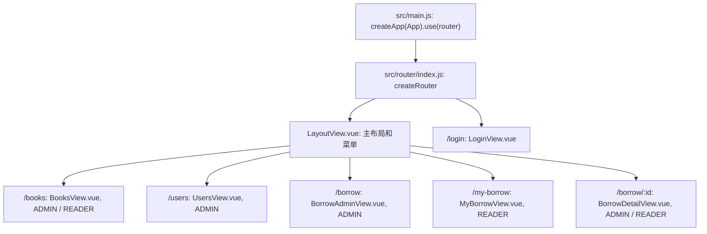
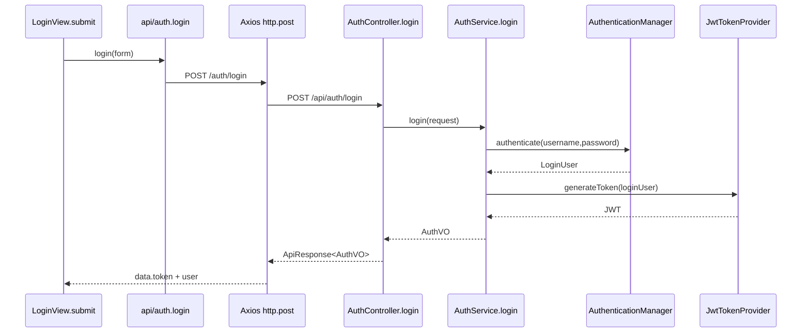
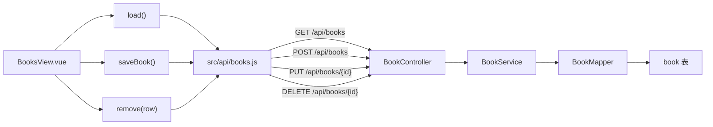
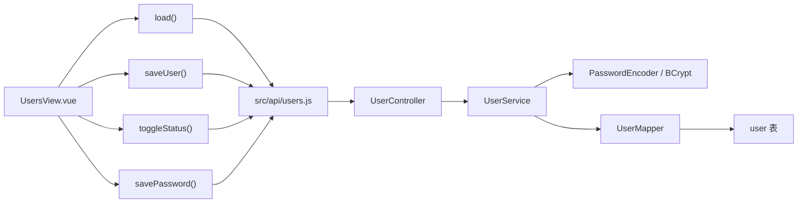
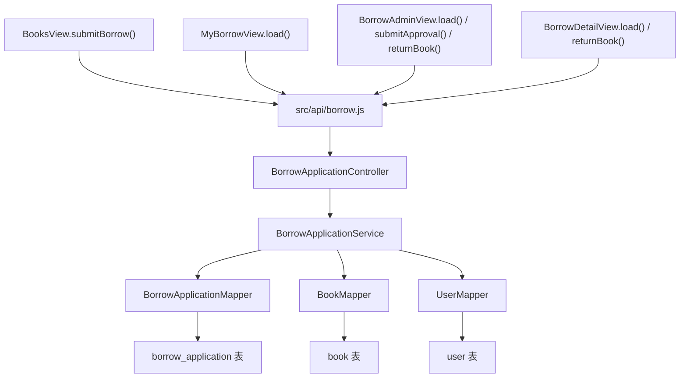

# 项目完整流程图

这份文档从“页面路由”和“后端接口路径”两个角度说明整个图书管理系统如何协作。重点是看清楚：前端哪个页面方法发起请求，请求路径如何拼接，后端哪个 Controller 方法接收，Service 和 Mapper 又做了什么。

## 1. 总体协作流程

```mermaid
graph LR
    Browser["浏览器"]
    Page["Vue 页面组件: LoginView / BooksView / UsersView / BorrowView"]
    ApiFile["src/api/*.js: 业务 API 方法"]
    Http["src/api/http.js: Axios 实例"]
    Vite["Vite Dev Server: http://127.0.0.1:5173"]
    Security["Spring Security: JwtAuthenticationFilter"]
    Controller["Controller 层: 接收路径"]
    Service["Service 层: 业务逻辑"]
    Mapper["Mapper 层: MyBatis-Plus"]
    DB["MySQL: library_demo"]

    Browser --> Page
    Page --> ApiFile
    ApiFile --> Http
    Http -->|"baseURL=/api"| Vite
    Vite -->|"proxy 到 http://localhost:8080"| Security
    Security --> Controller
    Controller --> Service
    Service --> Mapper
    Mapper --> DB
    DB --> Mapper
    Mapper --> Service
    Service --> Controller
    Controller -->|"ApiResponse JSON"| Security
    Security --> Vite
    Vite --> Http
    Http --> Page
    Page --> Browser
```



前端请求地址拼接规则：

```text
Axios baseURL: /api
业务 API 路径: /books
浏览器请求: http://127.0.0.1:5173/api/books
Vite 代理到: http://localhost:8080/api/books
后端匹配: @RequestMapping("/api/books")
```

## 2. 前端页面路由



路由守卫方法：

```text
router.beforeEach(...)
```

作用：

- 没有 Token 时跳转 `/login`。
- 已登录访问 `/login` 时跳转 `/books`。
- 根据 `meta.roles` 判断页面角色权限。

## 3. 后端统一安全流程

所有业务接口进入 Controller 之前，都会先经过安全链。

```mermaid
graph LR
    Request["HTTP 请求: 带 Authorization 头"]
    Filter["JwtAuthenticationFilter.doFilterInternal"]
    Resolve["resolveToken(request): 取出 Bearer Token"]
    Validate["JwtTokenProvider.isValid(token): 校验签名和过期时间"]
    Username["JwtTokenProvider.getUsername(token): 读取用户名"]
    UserDetails["CustomUserDetailsService.loadUserByUsername"]
    Context["SecurityContextHolder: 写入 LoginUser"]
    Rule["SecurityConfig.securityFilterChain: 路径和角色匹配"]
    Controller["进入 Controller 方法"]

    Request --> Filter
    Filter --> Resolve
    Resolve --> Validate
    Validate --> Username
    Username --> UserDetails
    UserDetails --> Context
    Context --> Rule
    Rule --> Controller
```



## 4. 每条接口路径的方法链路

### 4.1 认证接口

| 前端页面方法 | 前端 API 方法 | HTTP 路径 | 后端 Controller 方法 | 后端 Service 方法 | 主要后端方法 |
| --- | --- | --- | --- | --- | --- |
| `LoginView.submit()` | `login(data)` | `POST /api/auth/login` | `AuthController.login()` | `AuthService.login()` | `AuthenticationManager.authenticate()`、`JwtTokenProvider.generateToken()` |
| 可手动调用或扩展使用 | `me()` | `GET /api/auth/me` | `AuthController.me()` | `AuthService.current()` | `AuthService.toVO()` |



### 4.2 图书接口

| 前端页面方法 | 前端 API 方法 | HTTP 路径 | 后端 Controller 方法 | 后端 Service 方法 | Mapper 操作 |
| --- | --- | --- | --- | --- | --- |
| `BooksView.load()` | `listBooks(params)` | `GET /api/books` | `BookController.page()` | `BookService.page()` | `bookMapper.selectPage()` |
| `BooksView.saveBook()` | `createBook(data)` | `POST /api/books` | `BookController.create()` | `BookService.create()` | `bookMapper.insert()` |
| `BooksView.saveBook()` | `updateBook(id,data)` | `PUT /api/books/{id}` | `BookController.update()` | `BookService.update()` | `bookMapper.selectById()`、`bookMapper.updateById()` |
| `BooksView.remove()` | `deleteBook(id)` | `DELETE /api/books/{id}` | `BookController.delete()` | `BookService.delete()` | `bookMapper.selectById()`、`bookMapper.deleteById()` |



图书 Service 内部关键方法：

```text
BookService.page()
  -> LambdaQueryWrapper 构建查询条件
  -> bookMapper.selectPage()
  -> toVO()

BookService.create()
  -> assertIsbnUnique()
  -> applyRequest()
  -> bookMapper.insert()
  -> toVO()

BookService.update()
  -> getRequired()
  -> assertIsbnUnique()
  -> applyRequest()
  -> bookMapper.updateById()
  -> toVO()

BookService.delete()
  -> getRequired()
  -> bookMapper.deleteById()
```

### 4.3 用户接口

| 前端页面方法 | 前端 API 方法 | HTTP 路径 | 后端 Controller 方法 | 后端 Service 方法 | Mapper 操作 |
| --- | --- | --- | --- | --- | --- |
| `UsersView.load()` | `listUsers(params)` | `GET /api/users` | `UserController.page()` | `UserService.page()` | `userMapper.selectPage()` |
| `UsersView.saveUser()` | `createUser(data)` | `POST /api/users` | `UserController.create()` | `UserService.create()` | `userMapper.selectCount()`、`userMapper.insert()` |
| `UsersView.saveUser()` | `updateUser(id,data)` | `PUT /api/users/{id}` | `UserController.update()` | `UserService.update()` | `userMapper.selectById()`、`userMapper.updateById()` |
| `UsersView.toggleStatus()` | `updateUserStatus(id,data)` | `PATCH /api/users/{id}/status` | `UserController.updateStatus()` | `UserService.updateStatus()` | `userMapper.selectById()`、`userMapper.updateById()` |
| `UsersView.savePassword()` | `resetUserPassword(id,data)` | `PATCH /api/users/{id}/password` | `UserController.resetPassword()` | `UserService.resetPassword()` | `userMapper.selectById()`、`userMapper.updateById()` |



用户 Service 内部关键方法：

```text
UserService.page()
  -> LambdaQueryWrapper 构建查询条件
  -> userMapper.selectPage()
  -> toVO()

UserService.create()
  -> userMapper.selectCount() 校验用户名唯一
  -> passwordEncoder.encode()
  -> normalizeRole()
  -> normalizeStatus()
  -> userMapper.insert()
  -> toVO()

UserService.update()
  -> getRequired()
  -> normalizeRole()
  -> normalizeStatus()
  -> userMapper.updateById()
  -> toVO()

UserService.updateStatus()
  -> getRequired()
  -> normalizeStatus()
  -> userMapper.updateById()
  -> toVO()

UserService.resetPassword()
  -> getRequired()
  -> passwordEncoder.encode()
  -> userMapper.updateById()
```

### 4.4 借阅申请接口

| 前端页面方法 | 前端 API 方法 | HTTP 路径 | 后端 Controller 方法 | 后端 Service 方法 | Mapper 操作 |
| --- | --- | --- | --- | --- | --- |
| `BooksView.submitBorrow()` | `createBorrowApplication(data)` | `POST /api/borrow-applications` | `BorrowApplicationController.create()` | `BorrowApplicationService.create()` | `bookMapper.selectById()`、`borrowApplicationMapper.selectCount()`、`borrowApplicationMapper.insert()` |
| `MyBorrowView.load()` | `listMyBorrowApplications(params)` | `GET /api/borrow-applications/my` | `BorrowApplicationController.pageMine()` | `BorrowApplicationService.pageMine()` | `borrowApplicationMapper.selectPage()` |
| `BorrowAdminView.load()` | `listBorrowApplications(params)` | `GET /api/borrow-applications` | `BorrowApplicationController.pageAll()` | `BorrowApplicationService.pageAll()` | `borrowApplicationMapper.selectPage()` |
| `BorrowDetailView.load()` | `getBorrowApplication(id)` | `GET /api/borrow-applications/{id}` | `BorrowApplicationController.detail()` | `BorrowApplicationService.detail()` | `borrowApplicationMapper.selectById()`、`userMapper.selectById()`、`bookMapper.selectById()` |
| `BorrowAdminView.submitApproval()` | `approveBorrowApplication(id,data)` | `PATCH /api/borrow-applications/{id}/approve` | `BorrowApplicationController.approve()` | `BorrowApplicationService.approve()` | `borrowApplicationMapper.selectById()`、`bookMapper.update()`、`borrowApplicationMapper.updateById()` |
| `BorrowDetailView.returnBook()` / `BorrowAdminView.returnBook()` | `returnBorrowBook(id)` | `PATCH /api/borrow-applications/{id}/return` | `BorrowApplicationController.returnBook()` | `BorrowApplicationService.returnBook()` | `borrowApplicationMapper.selectById()`、`bookMapper.selectById()`、`bookMapper.updateById()`、`borrowApplicationMapper.updateById()` |



借阅 Service 内部关键方法：

```text
BorrowApplicationService.create()
  -> validateCreateDueDate()
  -> bookMapper.selectById()
  -> borrowApplicationMapper.selectCount() 检查重复申请
  -> borrowApplicationMapper.insert()
  -> toVO()

BorrowApplicationService.pageMine()
  -> 按 loginUser.id 限制 user_id
  -> borrowApplicationMapper.selectPage()
  -> toVO()

BorrowApplicationService.pageAll()
  -> 管理员查询全部
  -> borrowApplicationMapper.selectPage()
  -> toVO()

BorrowApplicationService.detail()
  -> getRequired()
  -> assertReadable()
  -> toVO()

BorrowApplicationService.approve()
  -> getRequired()
  -> resolveApprovalDueDate()
  -> bookMapper.update() 扣库存
  -> borrowApplicationMapper.updateById()
  -> toVO()

BorrowApplicationService.returnBook()
  -> getRequired()
  -> assertReadable()
  -> bookMapper.selectById()
  -> bookMapper.updateById() 恢复库存
  -> borrowApplicationMapper.updateById()
  -> toVO()
```

## 5. Controller 路径匹配规律

后端路径由类上的 `@RequestMapping` 和方法上的注解组合出来。

例如借阅申请：

```java
@RestController
@RequestMapping("/api/borrow-applications")
public class BorrowApplicationController {

    @PostMapping
    public ApiResponse<BorrowApplicationVO> create(...) {
    }

    @GetMapping("/my")
    public ApiResponse<PageResult<BorrowApplicationVO>> pageMine(...) {
    }
}
```

组合后得到：

```text
@RequestMapping("/api/borrow-applications") + @PostMapping
= POST /api/borrow-applications

@RequestMapping("/api/borrow-applications") + @GetMapping("/my")
= GET /api/borrow-applications/my
```

## 6. 返回数据流程

所有接口返回时都会用统一结构：

```text
Controller
  -> ApiResponse.success(data)
  -> Axios 响应拦截器
  -> 返回 response.data.data 给页面
  -> 页面更新表格、弹窗或提示
```

前端响应拦截器位于：

```text
demo-web/src/api/http.js
```

它会做两件关键事：

- 如果后端返回 `code !== 200`，显示错误消息。
- 如果 HTTP 状态码是 401，清空登录态并跳转登录页。
